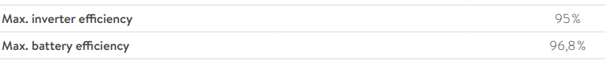
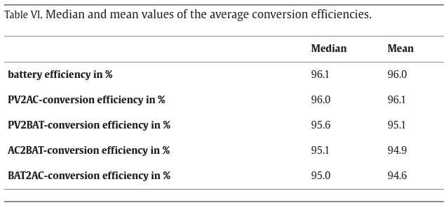

# Background and Reasoning (Why, oh why...?)

We have a small PV combined with a battery (SonnenBatterie 10) to store surplus energy generated by the PV.
During Winter, though... there isn't even enough generated energy to cover the the consumption during daytime. 

So, the idea arose to use a dynamic tariff (Tibber, in my case) to store energy when it is cheap to use it during times when it is more expensive.

However, there are a few things that need to be taken into account here:

## Conversion loss

During charging and discharging, there are conversion losses, especially with a battery that "feeds off" your home AC grid ("hybrid" PV inverters keep the DC current from the PV and store it in the DC battery directly.)
But hybrid or not, when there's nothing coming out of the PV, there's nothing to store, right? 

OK, so here we go:

#### Storing 
Energy from the grid (AC) is passing through the inverter and converted to DC, which is stored in the battery. We have conversion loss during conversion and during storage.

#### Discharging
The battery stores energy as DC and we need to convert it back to AC to use it. We have loss in the (DC) battery during the discharge process as well as conversion loss in the inverter, converting DC to AC.

### How much?

How much we are losing in the AC -> DC -> store -> discharge -> DC -> AC process depends on the efficiency of the battery and the inverter.

Sonnen claims 96.8% and 95%, respectively in their [data sheet](https://media.sonnengroup.com/dd373a24-6f4c-498b-b1a7-f222bebef369-en-download)

(I don't have a source I can quote right now, but I read somewhere that the efficiency for both is highest with higher currents, so we should try to charge with highest power possible)

I haven't measured mine, but those values fall in line with a research paper ("_Efficiency characterization of 26 residential photovoltaic battery storage systems_" [see appendix (1)]):

### Numbers
So, with the SonnenBatterie values (battery: 96.8%, inverter: 95%) we can caluculate (well, approximate) our loss as

AC -> DC (AC2BAT in the study): 95%  
Battery charge/discharge: 96.8%  
DC -> AC (BAT2AC in the study): 95%  

So, for every 1000Wh we feed in, we get 1000 *.95 * .968 * .95 = 873.62Wh out again, so we have an overall loss of 126.38Wh

In other words, our loss factor is roughly 1000Wh / 873.62Wh = 1.14 (or 14% loss across the whole charge/discharge cycle)

## What does that mean?

It means, we need to factor the loss factor into our price calculation, since power stored from the grid and used later is effectively 14% more expensive when being consumed than when it was stored (consumed from the grid, paid for by **_YOU_** ).

There are also other factors like "Battery Usage", but since Sonnen gives a warranty of 10 years or 10000 full cycles I expect the battery to die of age rather than wear.

There is also a [great video](https://youtu.be/zHZN35jeYxg) by "Akkudoktor" Andreas Schmitz [see appendix (2)] (in German only, though - but the auto-generated Youtube CC are working reasonably well) that explains a bit of background.

## Calculation

From here (we now know our loss factor), let's see [how I calculate](./calculation.md) what a "Cheap Hour" is - maybe you have a better or different idea. Create an issue or start a discussion here in the repo, I'd like to hear your feedback or improvement ideas. You can also fork and create a PR, of course ;-) 

Or, go to the [Overview](overview.md) that explains the basic principle of the flows.

## Appendix / Reference
[1]
> Nico Orth, Nina Munzke, Johannes Weniger, Christian Messner, Robert Schreier, Michael Mast, Lucas Meissner, Volker Quaschning  
> **Efficiency characterization of 26 residential photovoltaic battery storage systems**  
> Journal of Energy Storage  
> Volume 65  
> 2023  
> 107299  
> ISSN 2352-152X  
> https://doi.org/10.1016/j.est.2023.107299  
> (https://www.sciencedirect.com/science/article/pii/S2352152X23006965)  
> **Abstract:** Numerous loss mechanisms contribute to the overall performance of stationary battery storage systems. From an economic and ecological point of view, these systems should be highly efficient. This paper presents the performance characteristics of 26 commercially available residential photovoltaic (PV) battery systems derived from laboratory tests. They were measured according to the efficiency guideline for PV storage systems. Nine AC-coupled and 17 DC-coupled lithium-ion battery systems are compared. Their measured usable energy content varies between 5.8 kWh and 16.7 kWh and is in some cases more than 19 % below the specifications in the data sheets. Besides the usable capacity, the nominal power and the efficiency of the power conversion system are analyzed. DC-coupled PV storage systems are often advertised with inherently higher efficiency compared to AC-coupled systems. However, the comparison shows that they depend on high battery voltages of several hundred volts in order to exploit their efficiency advantages. The most efficient systems achieve average conversion path efficiencies of more than 97 %. In contrast, the values of the least efficient systems evaluated are only 90 %. Furthermore, the paper analyzes the control behavior by comparing the dead and settling times as well as the stationary control deviations of the investigated systems. Differences in the dead time of almost 3 s and in the settling time of more than 13 s can be observed. In addition, the AC, DC and peripheral power consumption in the fully charged and discharged state are evaluated. While individual systems have an outstanding power consumption of less than 4 W in the standby mode, others consume more than 70 W. The paper shows that various systems still have potential for optimization, especially in terms of conversion efficiency and standby losses. When selecting or optimizing a PV battery system, it is important to consider all loss categories to achieve high overall efficiency.

[2] 

https://www.youtube.com/@Akkudoktor

If you consider joining Tibber, I would like to ask you to use _*HIS*_ referral code for the 50EUR bonus. You'll get yours regardless whose code you use, but he is doing so much for the community, giving scientifically fact-checked background info, DIY tips&tricks, etc. 
This is his referral link: https://tibber.com/de/invite/akkudoktor or simply use the code `akkudoktor` in the Tibber sign-up process.

If you like his channel, please consider supporting him, he does great work - all on top of his day job as a scientist. 