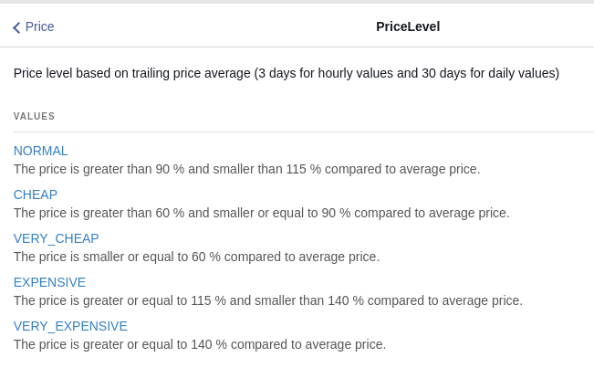
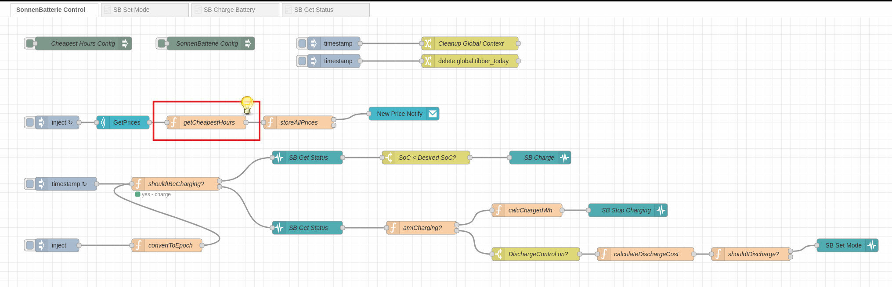
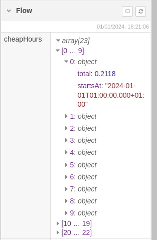
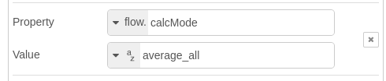
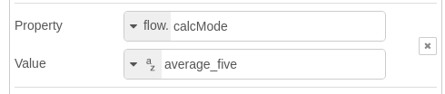
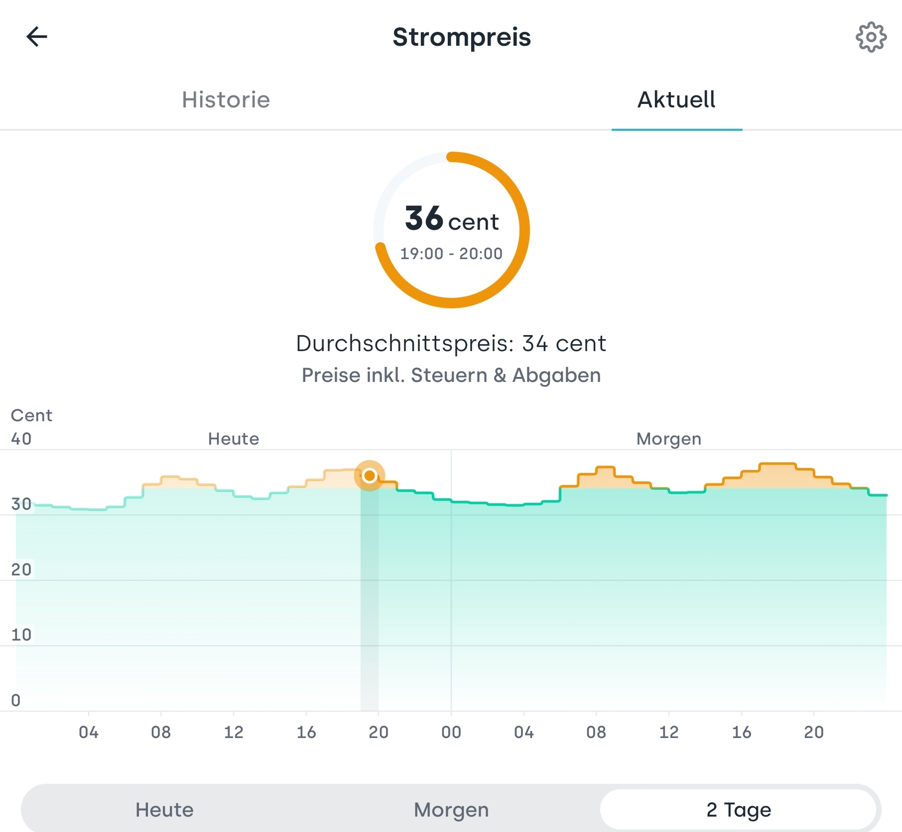
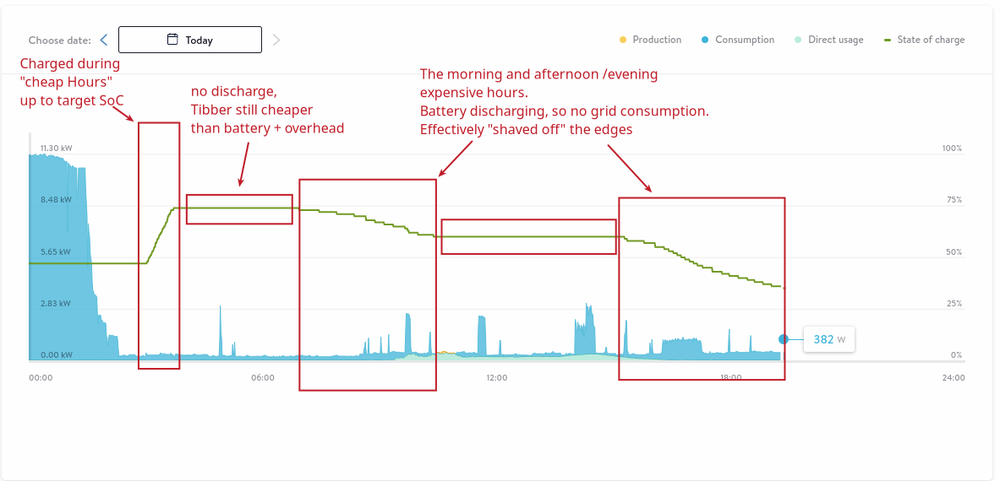

# Calculation 

## What is a cheap hour?

There are many ways to calculate what "cheap" is. Tibber even provides a "PriceLevel" in its API [https://developer.tibber.com/docs/reference#price](https://developer.tibber.com/docs/reference#price)

However, I wanted a bit more flexibility and granularity (I have to take the conversion loss into account, also)... 

## Key node

The key node for the calculation is the getCheapestHours node:

Based on its calculation, it stores the "cheap hours" in an array in the flow context. Other nodes (e.g. the "`shouldIBeCharging`" node) read this and then determine if they are in a "cheap Window" and what the the current cost is:

## How does it work ?

The "algorithms" (if they deserve that name) are rather simple:

### Default (average_all)

1) I get all available prices (that's either just today or today _and_ tomorrow)
2) I calculate the average price over that time horizon (24 or 48 hours)
3) I'm factoring in the "conversion loss factor" (see [Background](./background.md)) - the effective average price after the charging/discharging cycle is higher than the "real" price.
4) I also have a "userMaxPrice" to override calculation - I use whichever is lower (the factoredAverage or the userMaxPrice). So, if the price level is really high (the factored average would be higher than your set maxPrice) you can avoid charging above a certain level (even if the average tells you that it is cheap compared to the overall period).
5) All hours with a price lower that the result are considered "cheap Hours".

So, I get all hours that are below the factored average or the maxPrice.

**Example:**  
If the average price for today and tomorrow is 25ct/kWh, with a conversion loss factor of 20% (factor: 1.2) the "factored" average would be 20ct/kWh (or, 80% of 25ct).  
So, all hours equal or below 20ct would be considered "*_cheap enough for charging the battery_*"

### Average Five (five most expensive hours)

A bit more "agressive" than the default mode, however there is a reason for this:

If I calculate the average of only the five most expensive hours, I would get a wider charging window.  
So, I would be charging the battery, even though it is above the average over all hours...  
This might mean that the battery could be blocked from discharging during "medium price" hours, because the battery cost (including the loss) is higher than Tibber.

_However, I would "cut off" the most expensive hours._

#### Here's a real-life example: 

Using this method, I charged my battery for a price of roughly 30ct/kWh. With that, it wouldn't discharge when the Tibber-price is below 30ct*1.1 (the setting at that time, for testing, 1.15 would be more realistic), so the battery cost is calculated to 33ct/kWh.

However, I can now "cut off" the very expensive hours with prices > 33ct, where everyone is at home, the kids or wife start baking and cooking, etc.

**Example Tibber Prices:**

**Example Battery Cycle of the same date, so please compare the time ranges:**

# Next Step: Charging/Discharging

The process for charging/discharging (based on our "cheapHours") is explained in the [Charging / Discharging](./charging-discharging.md) chapter.
