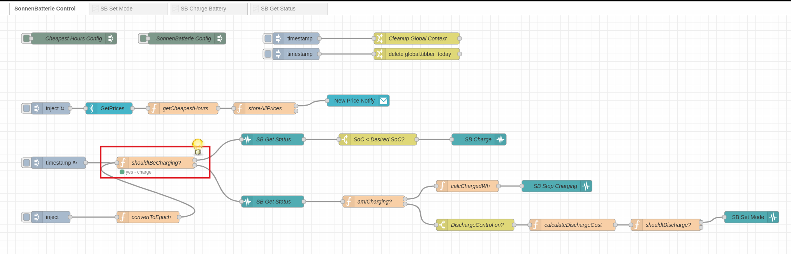
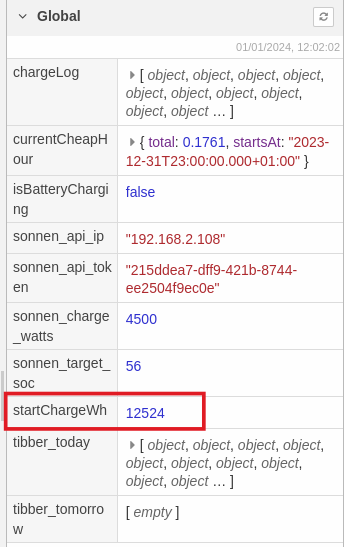
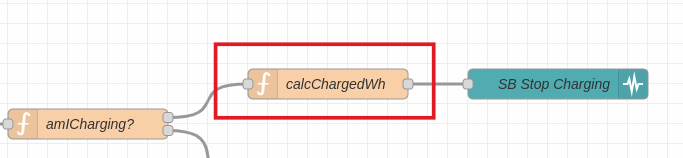
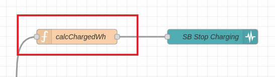
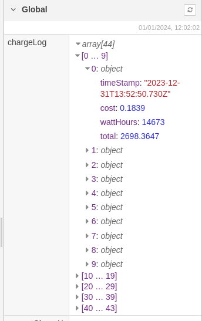
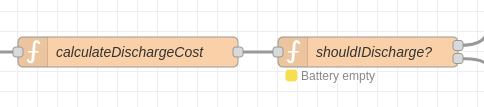

# Charging

## Key Node
The charging process is initiated by the "`shouldIbeCharging`" node, which is triggered every two minutes by the "timestamp" inject node. 

It reads the "cheapHours" array from the flow context (see [Calculation](./calculation.md)) and checks if the current timestamp lies within such a "cheap window". 
* If so, it continues in a flow that starts charging.
* If not, it continues in a flow that either stops charging (if charging is still "on") or controls the discharge (see "Discharging" below).

> **Note:** The "`Prepare Charging (OM=1)`" node in the "`SB Charge`" subflow stores the "`RemainingCapacity_Wh`" value from the SonnenBatterie API status call response in the "`startChargeWh`" variable in the Global context.   
>   
> When charging is stopped (either because we are no longer in a "cheapHour" or because the desired SoC has been reached), the "`calcChargedWh`" nodes take this value, compute the difference and store it in a "`chargeLog`" array in the Global context.  
> We need this later.  
>    
>    
>    

# Discharging
In the "no" arm of the "`shouldIbeCharging`" node's flow, there is a check if the battery is still charging. If it isn't, the discharging control starts. This will also be triggered every two minutes (if the battery shouldn't be charging).

In the `calculateDischargeCost` node, we are taking the `chargeLog` from the last 24h (assuming that prior entries will have been used already) and calculate an average cost of what's in the battery, based on cost and amount charged.  
We now have an approximate value of the "cost" of the Watthours in the battery.  
We pass that value to the `shouldIDischarge` node that compares the current Tibber price to the price of what's in the battery (times the conversion loss factor).  
If we are cheaper, then we allow the battery to do its thing (automatic self-consumption mode). If the battery cost is actually higher than what Tibber provides at the moment, we stop the battery from discharging. It's cheaper to use the grid in that case.

Once the battery is empty (SoC == 0), the chargeLog will be cleared.

> **IMPORTANT NOTE**  
> While the battery isn't discharging, it's also not charging from the PV. So, if you have enough surplus (PV power that is not used in your household), you should consider switching off the discharge control.

This is done in the configuration nodes (see [Configuration](configuration.md))

