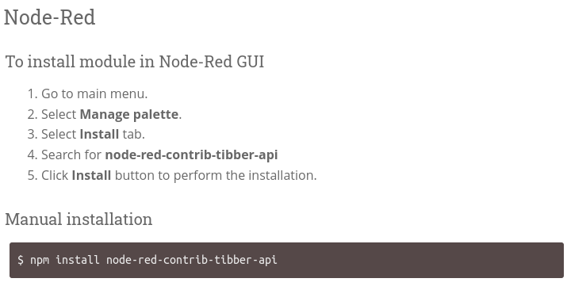
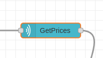
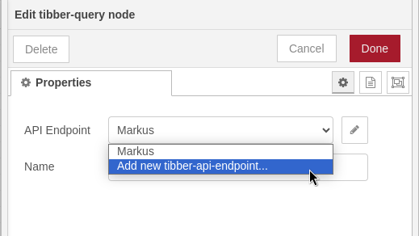
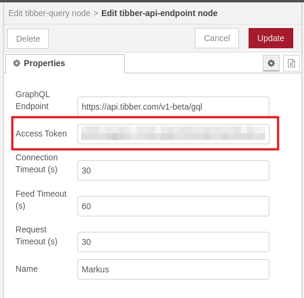
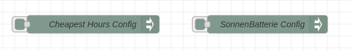
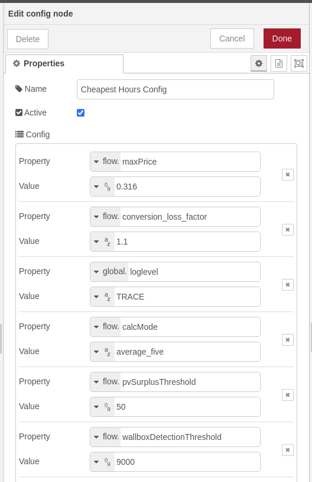
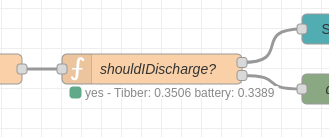
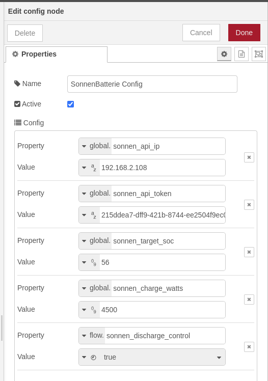
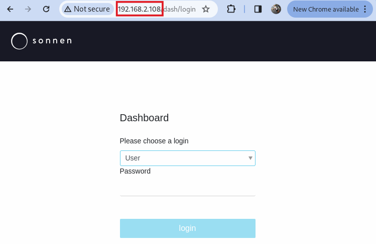

# Configuration

## Tibber

We are using the Tibber API nodes https://flows.nodered.org/node/node-red-contrib-tibber-api 

1) You need to install them before this flow will work (you can import the flow but it will tell you that there are some unknown node types).

You can do this as described on the above page: 



2) You need a Tibber API token, which you can get from https://developer.tibber.com/ and logging in with your regular Tibber account.

3) When double-clicking on the "`GetPrices`" node, a dialog opens where you can add a new tibber-api-endpoint. You need to add your personal Tibber API token here, otherwise the query will not work.

  




## Config Nodes

When importing the flow, you may get an error message because of unknown node types (similar to the above). You also need to install the https://flows.nodered.org/node/node-red-contrib-config config node type, since we are using that for these two config nodes.
(the installation process is simple, see the link)




Once installed, double-clicking on the config nodes will open their respective config screens:

### Cheapest Hours Config



where

#### maxPrice 
is the maximum price you're willing to charge for - even if today and tomorrow's averages are higher (let's say 30ct/kWh would be considered low with a 40ct/kWh average over today and tomorrow). So, if you're not willing to pay that much, set it to your wallet's pain threshold.  
However, if the calculated average prices (see: [Calculation](./calculation.md)) plus the conversion loss are higher than your set maximum, you won't see any "cheap Hours".  
But, to be honest - they're not really cheap then, are they?

#### conversion_loss_factor
is the factor by which power that went through a charge/discharge cycle is more expensive than directly from the grid. For the SonnenBatterie10, we caclulated this to roughly 1.14 (see [Background](./background.md)). Adapt to your needs.  
With a default of 1.2 (20% loss) you should be on the safe side.
> **Note** 
> The higher the value, the less likely it is you will see any "cheap Hours" as this is factored in when deciding what "cheap" really is, compared to the average (see: [Calculation](./calculation.md)).  
> Also, this can only be between 1.0 (no loss calculated) and 2.0 (100% loss - you have a warm home, as you have turned your battery/inverter into an electrical heater ;-) )

#### loglevel
Anything but "TRACE" will be ignored, but if you put "TRACE" in, you'll see a lot of informational messages in the log. 
You can access the log by ssh-ing into your Raspberry Pi and issuing the `node-red-log` command (this will follow the log so you'll see what happens as it happens...). 
If you want to dig in deeper into a specific time period, you can tell the Linux `journalctl` command, e.g.
```
journalctl --since "2024-01-08 02:00:00" --until "2024-01-08 06:00:00" -u nodered
```

#### calcMode
Can be either `average_all` or `average_five`. If it is neither of those values, it will default to `average_all`.
"average_five" is a bit more agressive in finding "cheap Hours" to "shave off" expensive edges.  
See [calculation](calculation.md) for more details.

#### pvSurplusThreshold (from v0.0.3)
If *"sonnen_discharge_control"* is enabled (see below), the battery will be put in "idle" mode (neither charging nor discharging) during times where Tibber is cheaper than the calculated cost of what's in the battery.  
However, this means that any PV surplus generated will be dismissed (i.e. it will be fed into the grid).  
From v0.0.3 on, if your surplus (Production - Consumption) exceeds this threshold, the battery will be set to "self-consumption" during these hours, so it can pick up the surplus and store it.  
Setting it to "0" might not be wise, as Production and Consumption tend to fluctuate a bit - and we don't want the battery to constantly change mode. It don't think there's any harm, but still... let's be lenient. My suggested threshold is 50W.

#### wallboxDetectionThreshold (from v0.0.3)
Normally, we would charge our cars during times when we'd also charge the battery (Tibber price is low). If that happens, the battery is either charging, too - or it is set to "idle" (don't discharge) because Tibber is cheaper than what's in the battery.

However, sometimes we need to charge our cars during other hours. If the battery is in normal operation (supporting your household) during those times, it will be sucked empty in no time.  
**_slurping sound effect here_**  
To avoid this, a very simple detection mechanism is implemented: If your overall consumption jumps above this threshold (say, 9000W) then you have either running four washing machines in parallel, or you are charging a car. 
During these high consumption hours, the battery will be set to "idle" if it is not charging. 

>**Note** This happens in the "shouldIDischarge?" node, which is part of the flow that is triggered every two minutes (unless you change it). So, the detection of a consumption scenario can also take up to two minutes... be patient ;-)  
> 


### SonnenBatterie Config



where

#### sonnen_api_ip
is the IP address of the SonnenBatterie in your local network (where you find the _local_ dashboard, _NOT_ any Sonnen-Server on the Internet). 


#### sonnen_api_token
is the SonnenBatterie API Token (not to be confused with the Tibber API token). You can obtain this by logging into your Sonnenbatterie und the IP address from above and then 
1) go to **Software Integration** on the left navigation menu
2) here, make sure you enable both read and write API (you can't control the battery settings and modes otherwise)
3) copy the API Token  


#### sonnen_target_soc
is the target SoC (State of Charge) that you want to charge to. Once reached, charging will stop, even if we're still in a "cheap Hour". 
**Remember**, if you charge your battery to 100%, there is no capacity left for any PV surplus that you might get the following day (depending on when you charge, the season, the weather, moon phases, you auntie Wilma's mood, etc.)

#### sonnen_charge_watts
is the power (in Watts) the inverter is charging the battery with. I have read somewhere that higher means a better efficiency, so I set the default to 4500 (the SB10's inverter maximum is 4600 but I haven't seen much higher values than 4500 during testing).
However, if you're worried that charging two cars, washing, cooking, baking, the tumble dryer, electrical kettle all running at the same time at night will overload your main fuses, you can limit it here.  

#### sonnen_discharge_control
is a switch that you can toggle. If "false", it will not control the discharge.  

