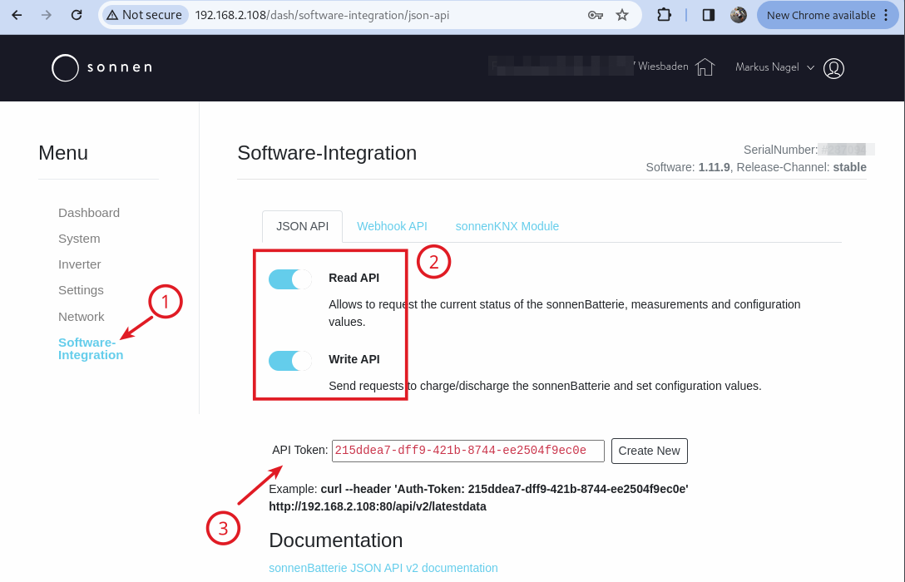

# Configuration

## Tibber

We are using the Tibber API nodes https://flows.nodered.org/node/node-red-contrib-tibber-api 

1) You need to install them before this flow will work (you can import the flow but it will tell you that there are some unknown node types).

You can do this as described on the above page: 

2) You need a Tibber API token, which you can get from https://developer.tibber.com/ and logging in with your regular Tibber account.

3) When double-clicking on the "`GetPrices`" node, a dialog opens where you can add a new tibber-api-endpoint. You need to add your personal Tibber API token here, otherwise the query will not work.

  

## Config Nodes

When importing the flow, you may get an error message because of unknown node types (similar to the above). You also need to install the https://flows.nodered.org/node/node-red-contrib-config config node type, since we are using that for these two config nodes.
(the installation process is simple, see the link)

Once installed, double-clicking on the respective config nodes will open their respective config screens:

### Cheapest Hours Config

where

#### maxPrice 
is the maximum price you're willing to charge for - even if today and tomorrow's averages are higher (let's say 30ct/kWh would be considered low with a 40ct/kWh average over today and tomorrow).

#### conversion_loss_factor
is the factor by which power that went through a charge/discharge cycle is more expensive than directly from the grid. For the SonnenBatterie10, we caclulated this to roughly 1.14 (see [Background](./background.md)). Adapt to your needs.  
With a default of 1.2 (20% loss) you should be on the safe side.
> **Note** 
> The higher the value, the less likely it is you will see any "cheap Hours" as this is factored in when deciding what "cheap" really is, compared to the average (see: [Calculation](./calculation.md)).  
> Also, this can only be between 1.0 (no loss calculated) and 2.0 (100% loss - you have a warm home, as you have turned your battery/inverter into an electrical heater ;-) )

### SonnenBatterie Config

where

#### sonnen_api_ip
is the IP address of the SonnenBatterie in your local network (where you find the _local_ dashboard, _NOT_ any Sonnen-Server on the Internet). 

#### sonnen_api_token
is the SonnenBatterie API Token (not to be confused with the Tibber API token). You can obtain this by logging into your Sonnenbatterie und the IP address from above and then 
1) go to **Software Integration** on the left navigation menu
2) here, make sure you enable both read and write API (you can't control the battery settings and modes otherwise)
3) copy the API Token  

#### sonnen_target_soc
is the target SoC (State of Charge) that you want to charge to. Once reached, charging will stop, even if we're still in a "cheap Hour". 
**Remember**, if you charge your battery to 100%, there is no capacity left for any PV surplus that you might get the following day (depending on when you charge, the season, the weather, moon phases, you auntie Wilma's mood, etc.)

#### sonnen_charge_watts
is the power (in Watts) the inverter is charging the battery with. I have read somewhere that higher means a better efficiency, so I set the default to 4500 (the SB10's inverter maximum is 4600 but I haven't seen much higher values than 4500 during testing).
However, if you're worried that charging two cars, washing, cooking, baking, the tumble dryer, electrical kettle all running at the same time at night will overload your main fuses, you can limit it here.  

#### sonnen_discharge_control
is a switch that you can toggle. If "false", it will not control the discharge.  
Due to the SonnenBatterie's API structure - if I want to avoid any discharge (because the grid is currently cheaper than what we charged the battery with (including loss)) then the battery needs to be in "idle" mode - it also won't automatically charge.
So, I would assume that we'll better switch it off during summer - or maybe I come up with some additional functionality that watches the surplus and reacts accordingly. 