# Overview
## What is it and what does it do?

The `SB-control-flows-*.json` are trying to make use of Tibber dynamic prices and charge/discharge the SonnenBatterie (tested with my SonnenBatterie 10, API v2) when it makes sense.

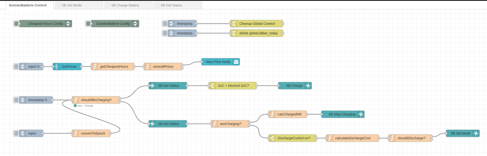

> **_NOTE:_**  `SB-control-flows-release.json` is the "cleaned up" version, whereas the `SB-control-flows-WIP.json` contains a lot of debug nodes and is a "work in progress". Since this is a small project I'm not making use of branches for now (with a "release branch" or "main" and feature/development branches). Maybe later.

## How does it do that?

I'll explain the various flows in more detail in their respective chapters, but for an overview see below.
If you're interested in the background (why?) and the calculations (algorithm) behind it, follow these links:

[Background](background.md)  
[Calculation / Algorithm](calculation.md)

### Configuration

These nodes store configuration, e.g. the IP of your SonnenBatterie (for API access)  
Config nodes are triggered when your flow is deployed, restarted or when Node-RED restarts (and then starts your flow)

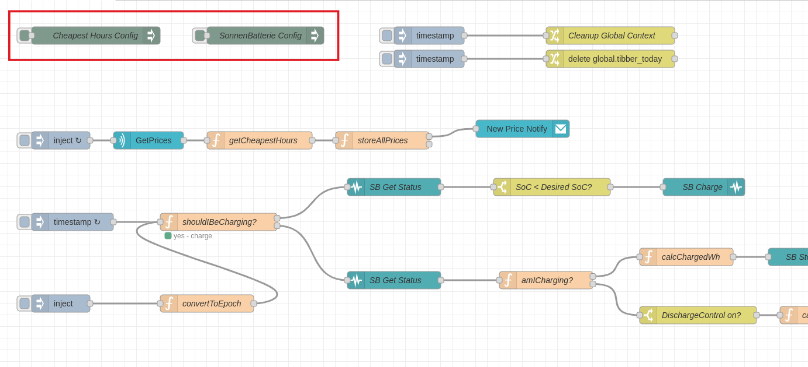

### Getting Tibber Prices
This is getting the current Tibber prices for today (and tomorrow, if available) and identifies the "cheapest Prices" based on a number of parameters.  
It is being triggered when the flow starts (on deployment or when Node-RED starts) and then runs once an hour.  
It will also send a notification to your Tibber App once it sees new prices.  

> **_NOTE:_** This is not a watchdog that notifies you _immediately_ when new prices are available. If prices are published at 13:15h, but this has last run on 13:14h, you won't get the info until 14:14h. I thought it's nice to have. 

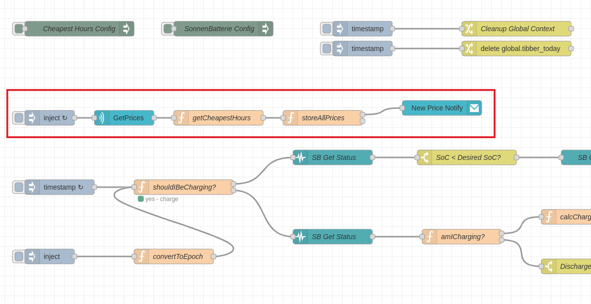

### Main Flow (Charge/Discharge Control)

This is the actual _Control Flow_. It is being triggered 10s after startup (to let the above Tibber Prices flow finish) and then runs every 2 minutes.  

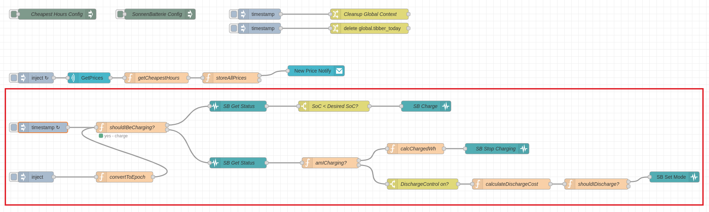

It uses the "cheap Prices" determined by the "Getting Tibber Prices" flow to determine if charging the battery makes sense.

* If yes, it queries the SB status and checks if the desired SoC has been reached. If below desired SoC, it will start charging. 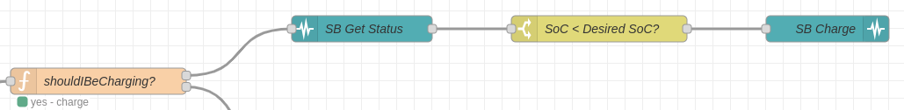
* If not, it queries the SB status and checks if it is still charging (this would be the first call after a "cheap Hour" is over)
    * if it is still charging, it takes note of the charged amount and stops charging 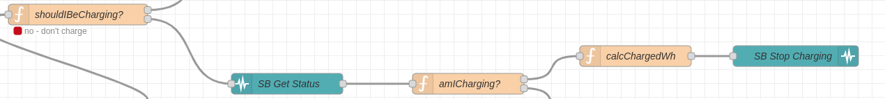
    * if it is not currently charging, we are outside of the "cheap Hours" and should check if we need to discharge. Maybe the current Tibber price is lower than what we charged the battery with. In that case, it would set the battery to "idle" (neither charging nor discharging), otherwise it lets it do its magic. 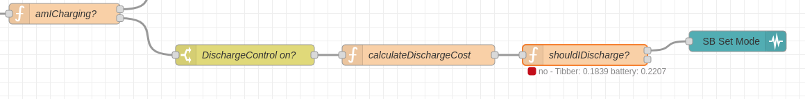

### SubFlows

There are a few subflows, that are "hidden" after import. You can access them by using the sidebar   
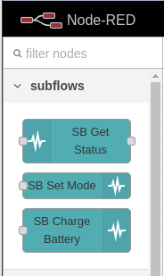   
or by opening (double-clicking) any of the nodes that use them   
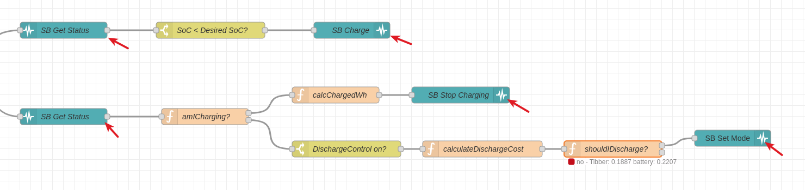    
and then editing the subflow template   
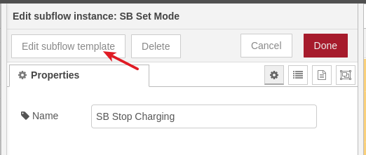

#### SB Get Status
This simply queries the status API of the SonnenBatterie. Since using the "Generic HTTP Request" node means you have to prepare a message accordingly that you pass in, I decided to wrap this into a subflow to remove some clutter.

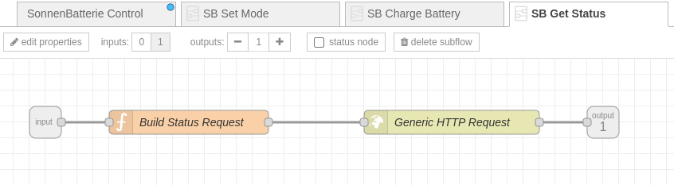

#### SB Set Mode
This sets the sets the battery to manual mode (OperatingMode = "1") or to the default "automatic" mode (OperatingMode = "2"), where the battery detects if it should charge/discharge.   
It checks if the requested mode is equal to the current mode. If it is, the flow ends here.  
If we continue, it sets the requested mode.   
It then checks if the mode that has been set is OperatingMode = "1" (manual/API mode). If that's the case, it also sets charging and discharging to zero. 
Reason: The SonnenBatterie retains the last API setting between mode changes. So, if it has been charging in OM=1, then set to automatic and then later (here) is set to OM=1 again, it will start charging again.   
This node is used in the "Discharge Control" flow only, so I can assume I want it to idle here (neither charge nor discharge).   
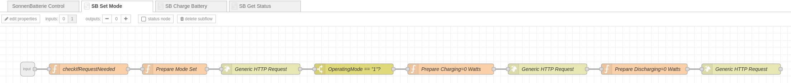

#### SB Charge Battery
If uninterrupted, this flow is charges the battery until it reaches the desired SoC, then takes note of the charged energy and then stops charging (sets the mode to "2").   
Since this is part of the general control flow, it is being triggered every two minutes, so we check if we are already charging. If so, the flow ends here (until the next trigger, of course).    
If on the outside of this subflow the charging has been stopped while we are still in this loop, there is a check ("stillCharging?") for the charging status. If charging has been stopped, the flow ends.  
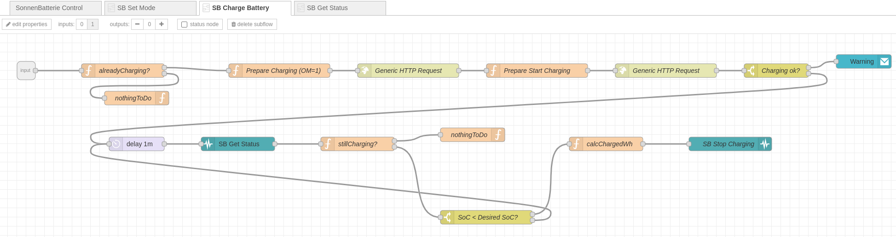

