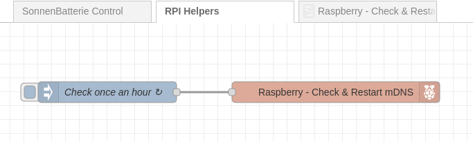
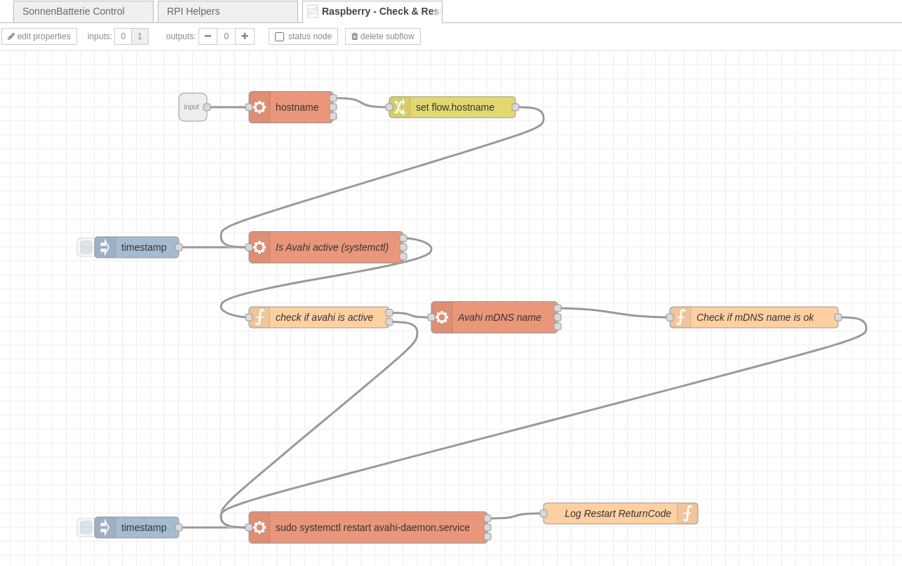

# Raspberry Pi OS and mDNS

It has been a recurring issue that at some point for no obvious reason, the Raspberry isn't available in my network anymore.  

**To be exact**, it hasn't crashed or lost connectivity, I can still reach it by its IP address... but the name `<hostname>.local` (in my case here `rpizero.local`) has disappeared and is no longer recognised in my network.  
As a consequence, I kept getting errors in the Node-RED UI, the status page bookmarks don't work anymore, etc. - until I switch to the Raspberry's IP. 

You can check that at anytime (if you know your Pi's IP Address) by logging in via `ssh` and checking the status of the `avahi-daemon`. 

> ["Avahi"](https://avahi.org/) is the component that announces the Pi's shortname in your network, bypassing the full DNS where you need to run a DNS server to resolve your names to IP Adresses in your local network... or need `/etc/hosts` entries on all computers.  
It is part of most major Linux distributions, works with Mac (called "Bonjour") and also Windows. That is why you can access your Pi almost immediately anywhere in your network (also on Apple and Android devices) after switching it on. 

If you are able to access your Pi via SSH (or you have attached a monitor and keyboard) you can check via

```
sudo systemctl status avahi-daemon.service
```
The output will look similar to this - the important parts here are
1) it is active and running: `Active: active (running) since`
2) the name it is broadcasting for your device: `avahi-daemon: running [rpizero.local]` - so `rpizero.local` in my case.
```
● avahi-daemon.service - Avahi mDNS/DNS-SD Stack
     Loaded: loaded (/lib/systemd/system/avahi-daemon.service; enabled; vendor preset: enabled)
     Active: active (running) since Wed 2024-01-17 12:37:05 CET; 5h 44min ago
TriggeredBy: ● avahi-daemon.socket
   Main PID: 162265 (avahi-daemon)
     Status: "avahi-daemon 0.8 starting up."
      Tasks: 2 (limit: 191)
        CPU: 41.206s
     CGroup: /system.slice/avahi-daemon.service
             ├─162265 avahi-daemon: running [rpizero.local]
             └─162267 avahi-daemon: chroot helper

Jan 17 17:17:28 rpizero avahi-daemon[162265]: Joining mDNS multicast group on interface wlan0.IPv6 with address 2003:e3:4f24:100:ae1f:340c:317c:4559.
Jan 17 17:17:28 rpizero avahi-daemon[162265]: Registering new address record for 2003:e3:4f24:100:ae1f:340c:317c:4559 on wlan0.*.
Jan 17 17:17:28 rpizero avahi-daemon[162265]: Withdrawing address record for fe80::3293:c8d7:25e:3745 on wlan0.
Jan 17 17:17:29 rpizero avahi-daemon[162265]: Joining mDNS multicast group on interface wlan0.IPv4 with address 192.168.2.128.
Jan 17 17:17:29 rpizero avahi-daemon[162265]: New relevant interface wlan0.IPv4 for mDNS.
Jan 17 17:17:29 rpizero avahi-daemon[162265]: Registering new address record for 192.168.2.128 on wlan0.IPv4.
```

Sometimes, though, it has a hiccup and thinks that the name is already present in your network and to avoid name collisions, it will assign a new one, typically `hostname-2.local` or `hostname-3.local`, which in my case was (as you might have guessed) `rpizero-2.local`, which breaks all my references to `rpizero.local` in bookmarks, ssh configurations, etc.

If that happens, you can simply restart the service via

```
sudo systemctl restart avahi-daemon.service
```

# The flow

However, I have become tired of this and automated a check via a [Node-RED flow](../RaspberryPiHelpers_flow.json):



You can simply import this as a new flow and it will start 120 seconds after deployment (wanted to give enough time for everything else that might start) and will then check once an hour. So, if your Pi isn't accessible anymore (because its name changed), just wait 59 minutes (worst case) and you'll be good again. 

## What does it do?

It is packaged as a subflow, so if you'll double-click the "_Raspberry - Check & Restart mDNS_" node, you'll see:



It uses the built-in "exec" node that executes command line programs.

1) It first executes the Linux `hostname` command, which gives us the assigned hostname. If not configured otherwise, the avahi-daemon will create a name from `hostname` plus `.local`.
2) It then asks the status of the avahi-daemon service and if it is not running, it will try to (re-)start it.
3) It then queries the status of the avahi-daemon service for the assigned name. If it is not `<yourhostname>.local` it will restart the service - this will happen if it sees e.g. `<yourhostname>-2.local` as your mDNS name. 

Restarting the service, either manually or via this flow (since you're running Node-RED anyway) will typically resolve this problem. 

It doesn't happen that often (maybe once a week) but when it does, it's a pain. 

Hope that helps - it does for me :-)


#### Addendum

If you have configured your Pi in a more secure way, i.e. the sudo command asks for your user's password, the above flow won't work. This is not the case for a default Raspberry Pi OS installation, but for sake of completeness:

In that case you would need to modify your `sudoers` file that lists who can execute which commands as super-user (root), which is required for a `systemctl restart` call.


**Modifying the sudoers File**: You can configure the `sudoers` file to allow certain commands to be run without a password. Use the `visudo` command to edit the `sudoers` file safely.

   - Open the sudoers file: `sudo visudo`
   - Add a line like this for systemctl:
     ```
     yourusername ALL=(ALL) NOPASSWD: /usr/bin/systemctl
     ```
   - Save and exit the editor.

   This allows `yourusername` to run `/usr/bin/systemctl` without a password.

