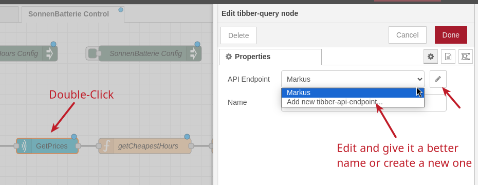

# Import the Flow to Node-RED

As a last step (or your first if you skipped the first two and you have a running Node-RED) we need to "install" (correct: Import) the flow to our Node-RED instance.

## Required Nodes

As outlined in [Configuration](../../configuration.md) the flow uses two other "custom" Node types. "Custom", because they are not part of the core Node-RED package:

1) Tibber
2) Config-Nodes

So, to avoid error messages, we first install those dependencies. However, if you jumped at it and imported the flow first, no worries - you can also install these Nodes later and it will then clear the error messages.

### Manage Palette 

Go to the "Burger Icon" on the top right and thenm select "Manage Palette"

There, click on the "Install" Tab, enter `node-red-contrib-tibber-api` and click the small "install" button.

Accept the warning and click the "install" button 

After a moment, you should see the following success message:

Now, repeat the same for the `node-red-contrib-config` Node Type:

  
 

Close the "Manage Palette" dialog now.

## Importing the flow

First, download the [release](../../../SB-control-flows-release.json) or the WIP [(work-in-progress)](../../../SB-control-flows-WIP.json) file of the flow (depending if you want a "cleaned up" version or one full of debug nodes).

In the left hand menu, now select "Import" 

In the Import dialogue, select "new flow" (well, if your first flow is still empty, you can leave it, but I make it a habit to always import flows into "new" flows, so I'm not messing up stuff I'm currently playing with).  
Then click on the "select a file to import" and import the flow file we just saved from above.  
(Don't get confused with the "local" tab on the left. "local" in that context means local to your Raspberry, i.e. in the Raspberry's file system on the SD card).

After importing, you should see the follwoing message, without errors or warnings:

## Configuring the flow

Go to your new "SonnenBatterie Control" Tab 

### Tibber

Double-Click the "GetPrices" Node - a dialog will apprear that allows you to create a new "API Endpoint". You can also use mine (in an outburst of ingenuity called it "Markus", you might want to use a better name, so rename it - or create a new one).  
Either way, you need to add your Tibber API Token here. 

  

Click "Update" once you have added your token.

### Cheapest Hours

Double-Click the "Cheapest Hours Config" Node and change values:

For "maxPrice" (the maximum you're willing to pay for a charged kWh, even if considered "cheap" in comparison to Tibber's "today" and "tomnorrow"), I have set 0.27 (in Germany, ct/kWh... **please check your local currency**. If you get the Tibber Prices in SEK, for example, you would get prices like 1.07. With a value of 0.27, you will never see a "cheap Hour", because the "maxPrice" is always lower than what Tibber provides you.)

For the conversion loss, we calculated that to 1.14 for the Sonnenbatterie and its inverter [here](../../background.md), so setting it to 1.15

Click "Done" when you're done ;-)

### SonnenBatterie Config

Double-Click on the Sonnenbatterie Config node - you need to set your API Token and your Sonnenbatterie IP Address here. Please refer also to the ["Configuration"](../../configuration.md) section of this repo on how to get these values. At least, the token. If you don't know your Sonnenbatterie's IP, check your router for such an entry with "SB-123456" where 123456 is your SB's serial number.  

## Deploy

After you have configured everything above, click "Deploy". This will deploy and start the flow on your Pi. This will run continuously without the browser UI, so if you wanted, you _could_ close the browser window now.

### Checking Values

If you want, you can open the "Context" and check what the current values are:

On the right, click on the little triangle "twistie" icon, and then open "Context Data":

You need to click on "refresh to see updated values (or any values, if you use it the first time).  
Then, in the "Flow" Context, you can see the identified "cheap hours" and their prices. For an explanation how these are calculated, see ["Calculation"](../../calculation.md)

In the "Global" context you can see a chargeLog (if there are any recorded charges and your battery hasn't gone to 0% SoC in the meantime).
Furthermore, you can see the Tibber Prices for today and tomorrow, if available. 

