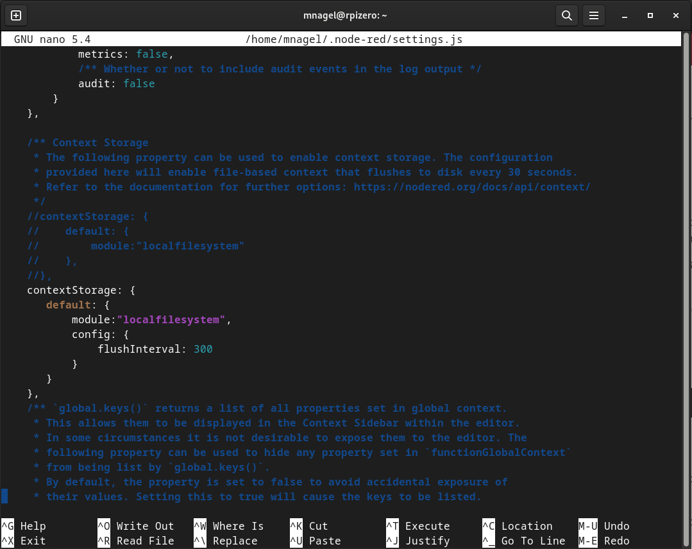

# Saving your data across Node-RED restarts

By default, Node-RED stores all context information (data that the flow saves somewhere, in our case the ChargeLog, among others) in memory. That is fast and doesn't "strain" your storage - so we don't write to disk everytime a value changes or is stored.

Especially with the limited lifetime of SDCards in Raspberry Pis, that is a good thing.

The downside of that is, that all your stored data will be lost when Node-RED (or the underlying Pi) restarts. For the majority of data in our case, that is not a problem, as e.g. Tibber data is being fetched on start of the flow and then every hour.

But, **your chargelog will be lost**. Worst case - your battery is full and then Node-RED restarts. You would lose all info about when and for what price you charged, and the flow would think the average cost is zero - therefore, it will allow the battery to discharge, because zero is always smaller than Tibber. You might lose a bit.


## So, it's your decision

(especially, because that can't be changed from a flow, you'll have to configure that in your Node-RED instance)

### Setting up persistence

To setup "persistence" (in other words, your contextual data will be saved and is stable across restarts), you can follow these steps:

For reference, here's also the section in the official documentation:  
https://nodered.org/docs/api/context/  
https://nodered.org/docs/api/context/store/localfilesystem  

https://nodered.org/docs/user-guide/runtime/settings-file

So, basically, what we need to do is  

1) Find the `settings.js` file that we are using
2) Add a section about the file-based context storage (as opposed to the default in-memory storage)
3) Restart Node-RED (and yes, we'll lose all context data one last time, then)


#### Find the settings.js

Your Node-RED prints the settings-file it uses every time it starts... so we'll just have to search the logs for the last startup. Doing that manually would be tedious, so let's use Linux magic ;-)

* login to your pi via ssh
```
[🎩︎mnagel ~]$ ssh rpizero.local 
mnagel@rpizero.local's password:

Linux rpizero 6.1.21-v8+ #1642 SMP PREEMPT Mon Apr  3 17:24:16 BST 2023 aarch64

The programs included with the Debian GNU/Linux system are free software;
the exact distribution terms for each program are described in the
individual files in /usr/share/doc/*/copyright.

Debian GNU/Linux comes with ABSOLUTELY NO WARRANTY, to the extent
permitted by applicable law.
Last login: Thu Jan 11 19:55:59 2024 from 192.168.2.130
mnagel@rpizero:~ $ 

```
* find all occurences of the string `settings.js` in your system log  
(the journal, if you have it installed as a system service)
```
mnagel@rpizero:~ $ journalctl -u nodered | grep settings.js
Jan 03 23:22:59 rpizero Node-RED[4813]: 3 Jan 23:22:59 - [info] Settings file  : /home/mnagel/.node-red/settings.js

```

So, in this case, the file is stored here: `/home/mnagel/.node-red/settings.js`


#### Edit the configuration to enable persistence

You can use a friendly Linux text editor, called `nano` to do that - and I would recommend to do that and not transfer it to your local Windows or Mac (no problem if you're running Linux) - especially Windows has the tendency to add invisible characters or format line breaks differently. As a result, your file might be garbled when you transfer it back to Linux (your Raspberry).

* Edit the file  

```
mnagel@rpizero:~ $ nano /home/mnagel/.node-red/settings.js

```
This opens your file with nano - scroll down until you see the section about context storage:  


You can simply uncomment the default proposed setting (remove the `//` on those five lines) - that is the default configuration that will "flush" your data to disk every 30s (so, you could lose 30s worth of context data if Node-RED restarts).  
In our case, even 30s can be considered too fast. We are not logging any data that fast - and to lower the strain on the disk even more, I suggest to add the following section instead (as you can see in the screenshot):
```
    contextStorage: {
       default: {
           module:"localfilesystem",
           config: {
               flushInterval: 300
           }
       }
    },

```
This sets the "flushInterval" to 300s (= 5min) instead.

Exit the editor using `<CTRL>-X` (it will ask if you want to save and where).


* Restart Node-RED

If you are running Node-RED as a system service (you followed this installation guide), just type `node-red-restart` or `node-red-stop` followed by `node-red-start`

To verify if it comes up correctly, follow the log via `node-red-log` (`<CTRL>-C` when you're done)  
If there is a problem with your config file, it will tell you when it starts and where the problem is.


