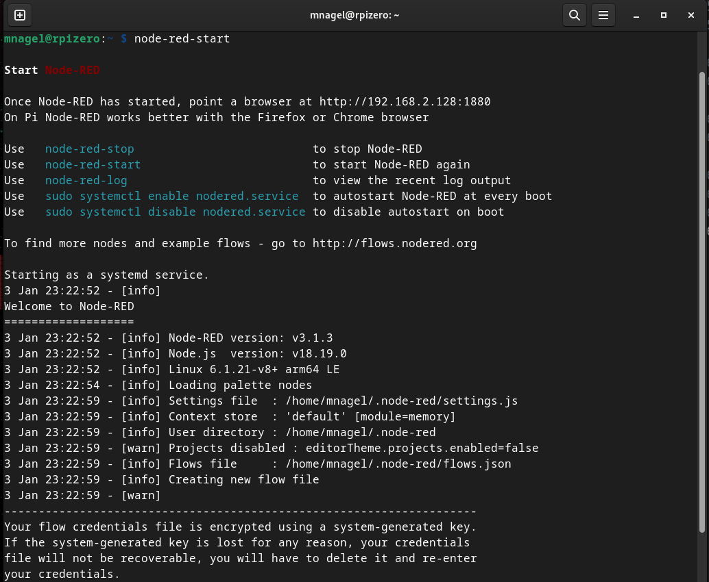

# Installing Node-RED

As mentioned before, there are many ways to install Node-RED. In this guide (since we are using a small Pi Zero that hasn't much room for anything fancy besides Node-RED and our flows), we will install it "natively" as a system service that comes back up when the Pi starts.  

Some will say, "why not use containers and run it in docker (or Podman)" - well, my answer is: The fewer components we have to manage, the fewer things can (and will) break. Also, if we are just running one container on this small Pi Zero, why accept the overhead of Docker/Podman? It's not much, but...still.

However, if you have a "bigger" Pi and would like to cleanly separate your workloads and manage multiple workloads in an easier fashion - I'm all for it. Give it a stab - here's the [documentation for running Node-RED containerized](https://nodered.org/docs/getting-started/docker)

However, here we'll stick to the "old-fashioned", simple and reliable systemd service.

### Login to your Pi

 Since we're doing this on the command line (we're all [**Command Line Heroes**](https://www.redhat.com/en/command-line-heroes/season-1) here, are we not), first login to your Pi via ssh (if you are still logged in from the Pi installation, you can use that terminal, of course.)

```
ssh <yourusername>@<yourpi>.local
```
so in my case

```
ssh mnagel@rpizero.local
```

>**Note** The following steps are just taken from the [offical Node-RED documentation](https://nodered.org/docs/getting-started/raspberrypi) which I recommend going through for more detail.

### 1) Make sure we have all the tools installed it may need

```
sudo apt install build-essential git curl
```
As you can see, some were not available in our install yet and have now been installed.  


### 2) Run the install script

This script will:

* remove the existing version of Node-RED if present.  
* if it detects Node.js is already installed, it will ensure it is at least v14. If less than v14 it will stop and let the user decide whether to stay with Node-RED version 1 - or upgrade Nodejs to a more recent LTS version. If nothing is found it will install the Node.js 16 LTS release using the NodeSource package.  
* install the latest version of Node-RED using npm.  
* optionally install a collection of useful Pi-specific nodes.  
* setup Node-RED to run as a service and provide a set of commands to work with the service. 

>**Note** If all these techie wordles above don't mean anything to you, that's fine. Really. The script basically installs everything that it needs and configures everything so Node-RED should simply run on your Pi. Simple as that. :-)

```
bash <(curl -sL https://raw.githubusercontent.com/node-red/linux-installers/master/deb/update-nodejs-and-nodered)
```
Just make sure you copy the full command line as shown above.

You can (but don't need to) install Pi-specific nodes (that do some magic with the GPIO [General Purpose I/O] pins - so you could switch on something using Node-Red or read data from those pins and have a Node-RED flow react to it... but we don't need that for THIS flow.)

Especially on a Pi Zero, this will take a while... if you're curious what's happening and how busy your Pi is... open a **Second SSH Session** (don't touch the running one...) and play Peeping Tom using `htop`:

After logging in, just enter `htop` on the command line and press return (you can quit htop by pressing F10 or `q` (for quit)):


Once the installation is done, it will present you a **WARNING** screen that you should take to heart: **DO NOT EXPOSE NODE-RED TO THE OPEN INTERNET WITHOUT SECURING IT FIRST**

Well, we just want to control our Battery Charging here and securing Node-RED is a bit beyond this guide, but if you plan to do so, please read https://nodered.org/docs/user-guide/runtime/securing-node-red first!

We can just say "no" to the _"Would you like to customise the settings now (y/N) ?"_ dialog (or wait a minute as it ends automatically if you don't choose an option afor a while)

### 3) Verify the installation

You can use `clear` to clean up the window, should you feel the urge to do so.  
Then, simply enter `node-red-start` and it will start the Node-RED service on your Pi. So, after you see the 

```
3 Jan 23:22:59 - [info] Server now running at http://127.0.0.1:1880/
3 Jan 23:22:59 - [warn] Encrypted credentials not found
3 Jan 23:22:59 - [info] Starting flows
3 Jan 23:22:59 - [info] Started flows

```
message, you can safely quit that command using `<CTRL>-<C>`, as the service will continue to run.



Now, point a browser to the Pi's IP Address at Port 1880 (as shown in the log output above) or your Pi's local name:


## Another success!

You just installed Node-RED on Linux via Command Line. Cool, eh?


## One last thing to do

Node-RED now runs as a system service, happily in the background. But it won't start automatically (yet).

For that, issue the command 
```
sudo systemctl enable nodered.service 
```
once - after that, it will start whenever your Pi starts. And thus, all your flows will also auto-start on boot.

You can check the service status at any time with 
```
sudo systemctl status nodered.service
```


You're done here! :-)


