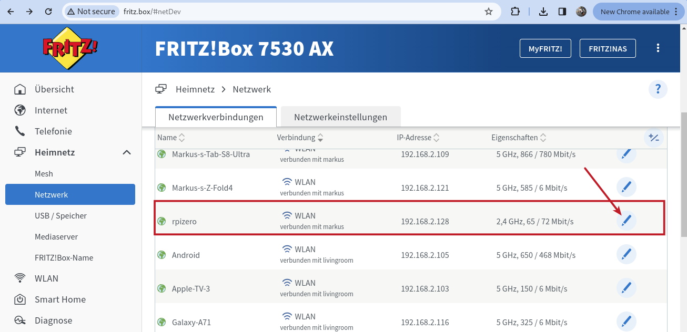
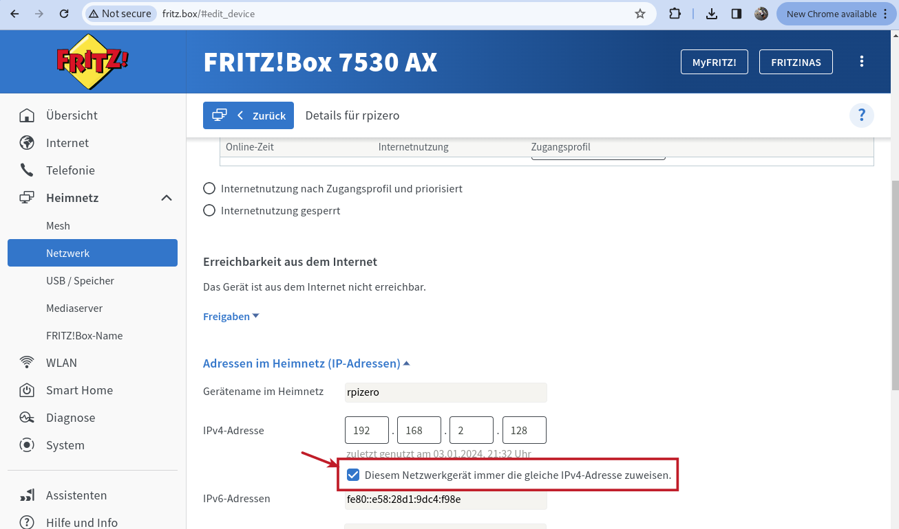

### On a FritzBox (should you be using one)

1) Go to the Home Network Connections page and look for the name that you have given your Pi (rpizero in my case) and click on the "edit" symbol

2) Then scroll down and tick the box "always assign the same IP"

_Apologies for the German screenshots, haven't figured out how to switch the UI to English on short notice..._