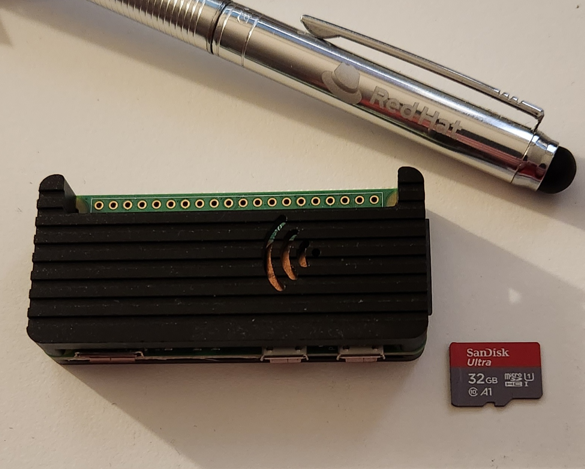
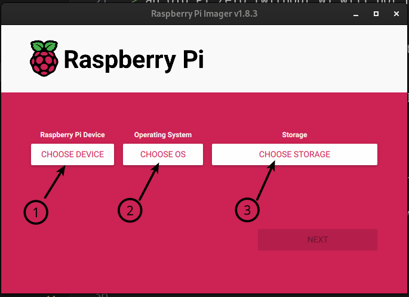
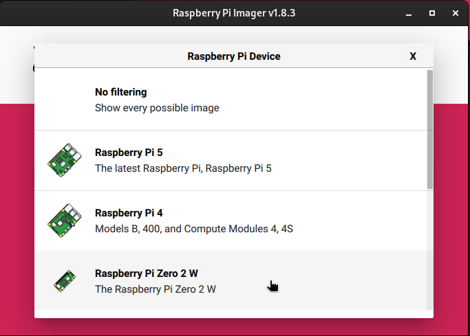
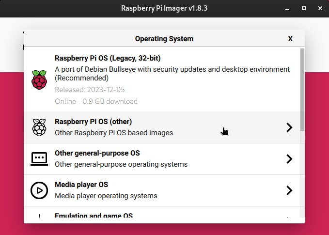
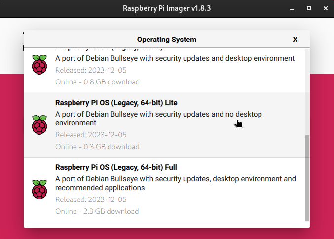
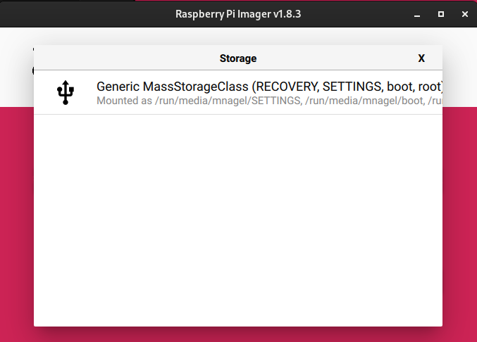
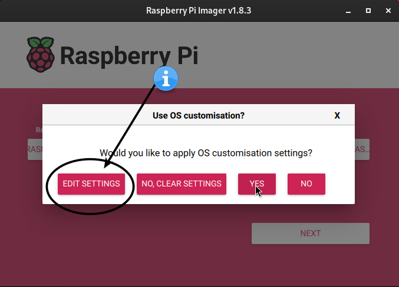
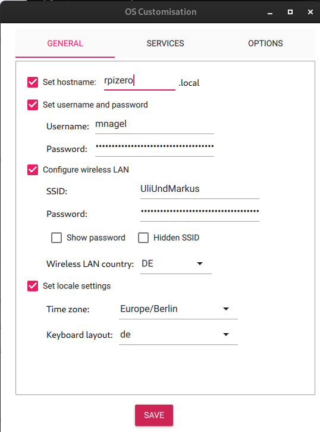
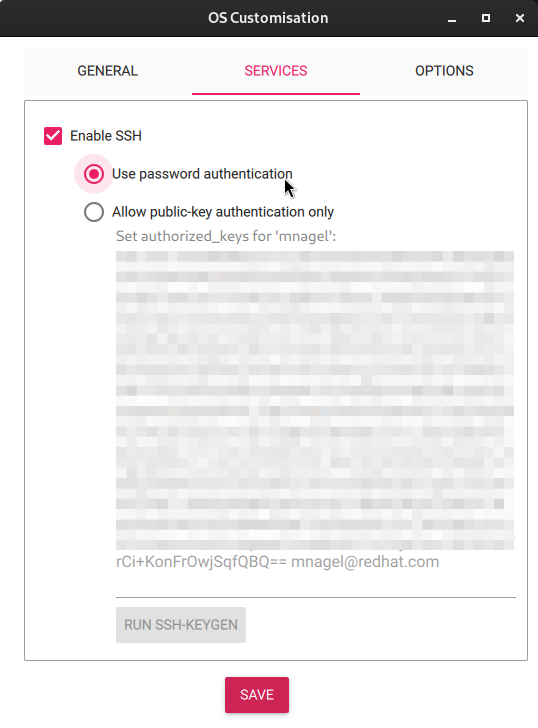
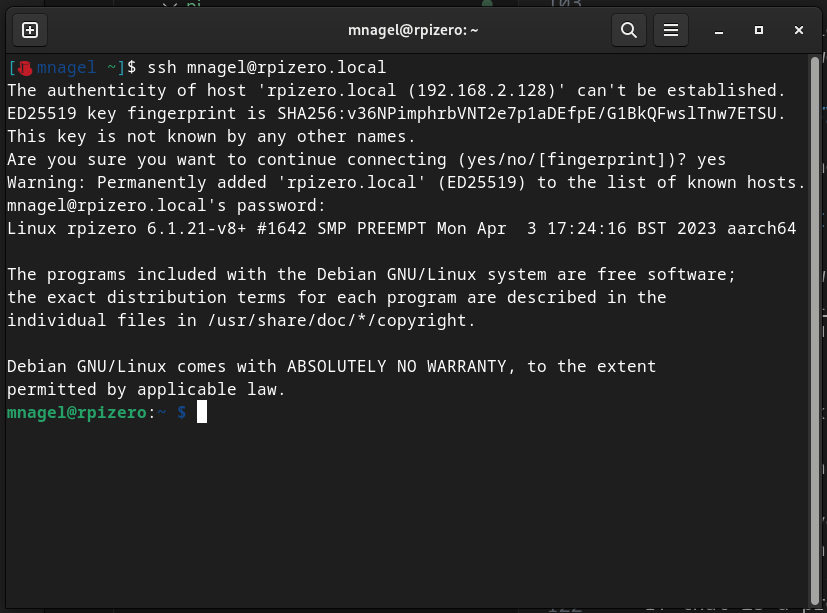

### DISCLAIMER
There are many, many ways you can use and install Node-RED, e.g together with [Homeassistant](https://www.home-assistant.io/) on a Raspberry Pi4, on a virtual machine on [ProxMox](https://www.proxmox.com/en/proxmox-virtual-environment/overview), etc etc etc...

This little guide just focuses on the bare minimum you need to do to get this particular flow running. If you want more - do more ;-)) 

# Raspberry Pi installation

If you have an unused Raspberry Pi gathering dust, this would be fine.  
If you need to buy a new one and just want Node-RED and this flow to run, a small [Pi Zero 2W](https://www.raspberrypi.com/products/raspberry-pi-zero-2-w/) is more than sufficient.  
In addition to the "raw" Pi, you'll need  
* a microSD card  
* a microUSB cable/Power supply
* maybe a case, any will do but it'll work fine without. Unless you poke the circuitry with some metal. So, get a case.
* Oh, yes - and a computer with a browser, a Wifi-Network that both your computer and your Pi can connect to.  
    * For our flow, the WLAN the Pi is connected to needs internet access (to query Tibber) and access to your SonnenBatterie (to control charge/discharge)  
Sounds supercomplicated, but it isn't - in most cases, that will just be your home WLAN. 


> **_Note_**: If you're checking out eBay and the likes, please make sure that what you're getting 
> it really a **_Pi Zero 2W_**   
> an old Pi Zero (without W) will not have WLAN, so you'd have to hookup an exteral USB WLAN or Ethernet Adapter  
> an old Pi Zero (without the 2) might struggle with the load, as the Pi Zero 2W is faster. It could work, but I haven't tested it.  

If you want more from your Pi than just Node-RED (e.g. you want to run a Desktop environment and hook it up to a monitor to use as a Desktop PC) you should use a Pi4 or the new Pi5.

For the sake of our use case here, I'll just explain the bare minimum that will run perfectly fine on a Pi Zero with its tiny 512MB RAM. Linux to the rescue ;-)

## My Pi

I run Node-RED and the flow on this tiny PI Zero 2W, but as I said, any better Pi (Pi 3,4 or 5) will be fine.   
(Pen and SD Card for size comparison)  
I'm using an aluminium case that also works as a heatsink (but dampens a bit of the WLAN signal so not recommended if you plan to put your Pi in some distance of the WLAN access point when you're done - a plastic case will work better there). 


## Installation

First, download and install the [Raspberry Pi Imager](https://www.raspberrypi.com/software/) on your computer - we need this to download and install the Raspberry OS on the SD Card.
Again, there are other options to do this that you might come across when googling or searching YouTube, but I'm using the default OS (yes, you can install other Operating Systems if you want) and default tool here.

> **Note** If the following screenshots look slightly different on your computer, don't worry - I'm running [Fedora Linux](https://fedoraproject.org/) but Windows and Mac will look similar enough.

### Imager

Now that you have the Raspberry Pi Imager installed, start it.

[Now is also a good time to insert your microSD card in your card reader]



We'll follow a simple three-step process:

1) Choose the device we have
2) Choose an OS (it will automagically download it)
3) Select the SD Card

#### Device
We have a Pi Zero 2W, so let's choose that (this is just a helper, filtering the available options - if you have a different Pi, you can choose that or just use the "no filtering" option).  


#### Operating System
For our Pi Zero, we'll choose a different than the suggested OS, simply because we don't want a Desktop Environment. The Pi will run our Node-RED (which has a browser interface we will use on our "real" desktop). Also, we don't plan to hook it up to a monitor, as it should run "somewhere in the cellar", or so.  

With that said, select "Other"  


We will then choose the "lite" version of the 64bit OS.  
* 64bit, because many applications these days (if you plan to run other stuff than Node-RED) aren't supporting 32bit anymore. Also, I haven't even tested if Node-RED runs on a 32bit OS. I suppose so, but... I prefer to stick with 64bit wherever possible. 
* "Lite" because we don't need a Desktop environment. If we don't need it - why install it?



> **Note**: If you have a "bigger" Pi (3,4,5) or you would give a Linux Desktop environment a try, you can choose one of the other 64bit options, either with a Desktop environment or with Desktop and preinstalled applications. In this guide, we'll focus on "lite", but all the steps also work with a "full" install - however, we don't use any of those additional features you might be installing.   
> Also, if you want to use a Desktop environment, you need to attach a keyboard and mouse via USB or Bluetooth or use VNC for a remote desktop, which is all beyond the scope of this guide. However, there's plenty of info available on that on the [Raspberry documentation](https://www.raspberrypi.com/documentation/computers/getting-started.html) site.

#### Storage
Select the microSD card that you inserted. If you haven't already - do it now ;-)  
_[This will look different depending on your OS and if the card is blank or has some stuff on it already, as in my case]_  



## IMPORTANT

Now that you have selected everything, click on "next" but **before you proceed and click "yes" here, make sure to click on "Edit Settings".**  
We need customize our settings so we can access our Pi without the need to attach monitor and keyboard.



This opens the following window:



Configure your WLAN access and give it a user and password (don't forget, that's important later!).
Also, you can later access the Pi using (in my case) `rpizero.local` instead of its IP Address for ease of use. Give it a cool name, such as "HAL9000" or so.

### Services
**Also very important, enable SSH on the second tab.**   
If you have a public SSH key, you can add it here and enable "public key authentication". If you have no clue what I'm talking about, simply stick to "password authentication". When logging in, it will ask the password that you assigned in the previous step.



### ...aaaand you're done
You can write the customized OS to the card now.

For sake of completeness, you _could_ also configure all these settings on the first Pi startup - but for that, you would need to attach a monitor and keyboard, which we want to avoid.

## Verifying everything worked

You can insert the SD card into your Pi and connect it to power. Wait a few moments until the green light has stopped blinking frantically (takes a minute or two on the fist boot, much quicker later).

### Access the PI via SSH

I am not a Windows user, but it seems that from Windows 10 on, you have an [SSH client already installed](https://learn.microsoft.com/en-us/windows/terminal/tutorials/ssh).  
If not, you can use good old [puTTY](https://www.putty.org/).


For Mac and Linux, this is pretty standard and should be included.

So, open a terminal (or puTTY) and connect to your Pi with its short name (that you gave it during customization) or its IP Address

> **Note:** I have noticed that sometimes the "mDNS" server on the Pi - "the thing" that announces your Pi on the network (goes by name of "avahi") - has a hiccup and assigns itself a new name.   
Therefore, it is a good idea to take note of the IP it has been assigned and configure your router to always give it the same IP ([Example](fritz.md))  
> If that is a problem - if you lose connectivity (it used to work for a while with e.g. "rpizero.local" but then it doesn't): Try "rpizero-1.local",  "rpizero-2.local", etc. 
> Or, simply restart your Pi and wait a few minutes until it has announced its new (old) name.

```
ssh <yourusername>@<yourpi>.local
```
so in my case

```
ssh mnagel@rpizero.local
```
and enter the password you set



```
df -h
```
tells us how much diskspace we have left (27GB on a 32GB SD Card).

```
mnagel@rpizero:~ $ df -h
Filesystem      Size  Used Avail Use% Mounted on
/dev/root        29G  1.4G   27G   5% /
devtmpfs         80M     0   80M   0% /dev
tmpfs           210M     0  210M   0% /dev/shm
tmpfs            84M  920K   83M   2% /run
tmpfs           5.0M  4.0K  5.0M   1% /run/lock
/dev/mmcblk0p1  255M   31M  225M  13% /boot
tmpfs            42M     0   42M   0% /run/user/1000
mnagel@rpizero:~ $ 

```
as the last step, let's just make sure we have all the latest and greatest fixes and patches (for more info, see [using apt](https://www.raspberrypi.com/documentation/computers/os.html#using-apt) in the Raspberry Documentation).

Quote from the docs:

APT keeps a list of software sources on your Raspberry Pi in a file at /etc/apt/sources.list. Before installing software, you should update your package list with apt update. Go ahead and open a Terminal window and type:
```
sudo apt update
```
Next, upgrade all your installed packages to their latest versions with the following command:

```
sudo apt full-upgrade
``` 

Note that full-upgrade is used in preference to a simple upgrade, as it also picks up any dependency changes that may have been made.


## Alrighty, then - we have installed and configured our Pi!


