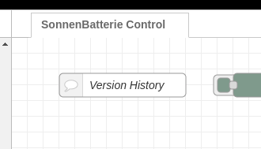
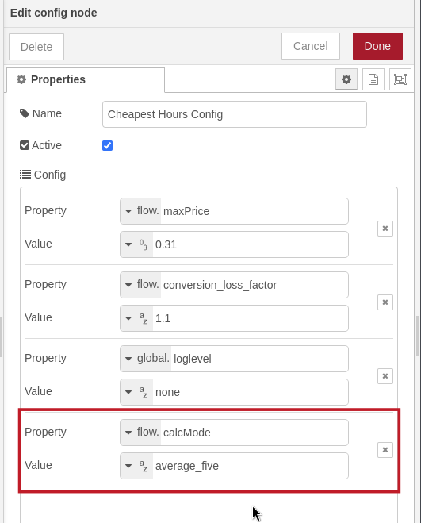
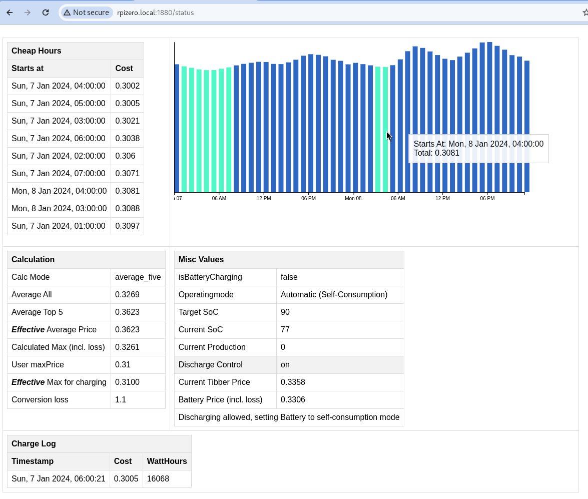
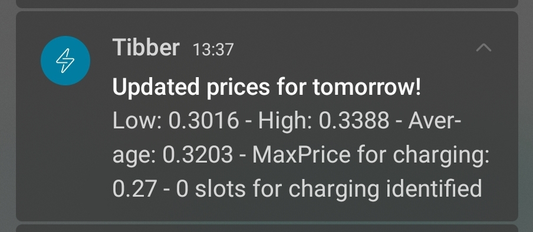
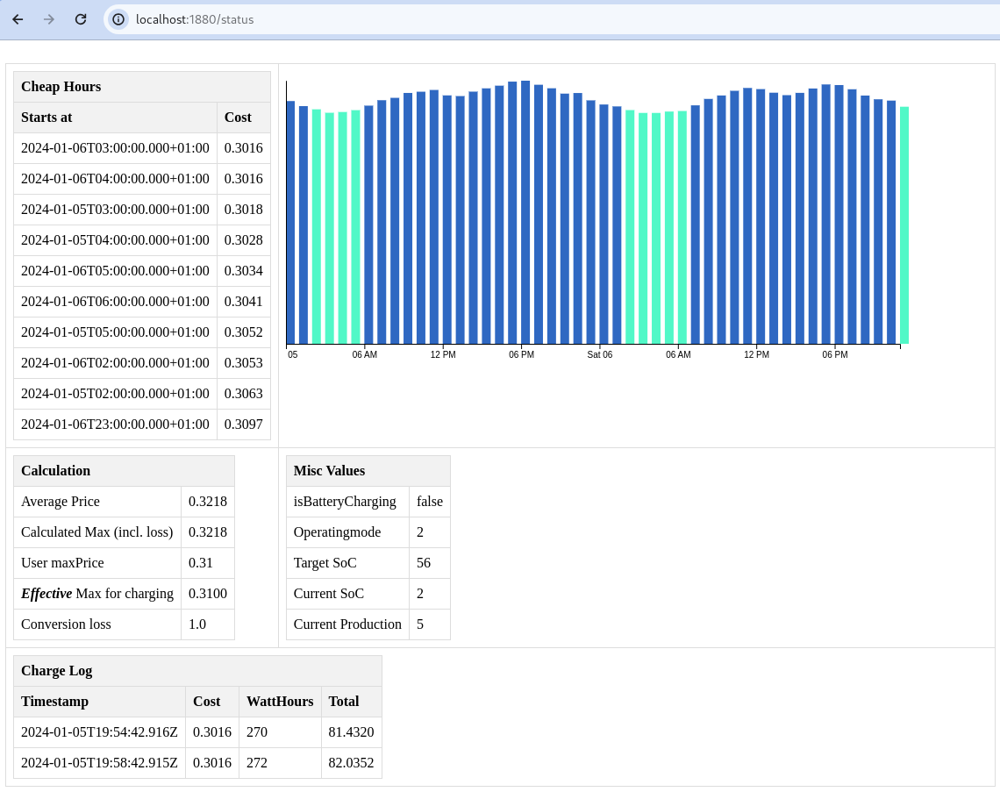

# Release notes

As this thing is continuously being developed, I though it might be wise to add a "Version History" node to the flow itself as well as some notes about those "releases" here.  

|Date   |Version   |Notes   |
|---|---|---|
|2024-01-07  | V0.0.2  | Cleaned up release version (removed debug nodes and aligned nodes to remove the clutter)|
||||
|2024-01-06  | V0.0.2-WIP  | added flow.calcMode (`average_all` or `average_five`), calculates base average across all or across top 5 hours. The default (if you leave it empty) is `average_all`. `average_five` checks for the average of the most expensive five hours and tries to find hours for charging that are below that (including loss). As a result, the battery might be stopped from discharging during a couple of hours (price of battery power is higher than Tibber) - but it will then discharge during the most expensive hours and "cut off the peak".  **IMPORTANT** - This only makes sense if you also set the `sonnen_discharge_control` to "true" (in the "SonnenBatterie Config" Node). Otherwise, you would discharge during hours where the current Tibber might be cheaper than the cheapest Tibber hours plus calculated loss|
| | | 
| | | added tooltip to prices on status page, so it's easier to see when those identified "cheap Hours" are happening. |
| | | 
| | | added discharge control settings and values on status page |
||||
|2024-01-05   |V0.0.1 - WIP  | **only the WIP has been updated**, will update the "clean" version soon|
|   |   |started versioning, added some debug logging  |
|   |   |(enable via GLOBAL.loglevel = "TRACE" in Cheapest Hours Config) |
|   |   |added /status page (just go to your Node-RED instance, e.g. http://mypi.local:1880/status |
|   |   |Bugfix: Tibber push was broken due to newlines (which Tibber doesn't like)  |
|   |   | |
|   |   |Some minor fixes (formatting, etc)    |
|   |   |Status page    |
|   |   |   |

# V0.0.2-WIP   2024-01-06
- added flow.calcMode (average_all or average_five), calculates base average across all or across top 5m default is _all
- added tooltip to prices on status page
- added discharge control settings and values on status page
