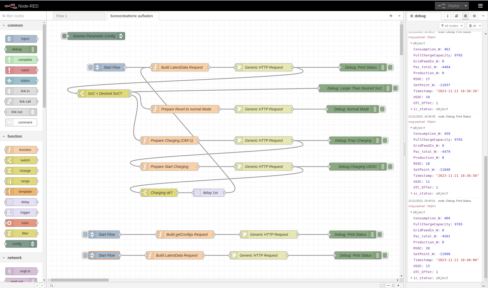

``` 
podman run -it -p 1880:1880 -v node_red_data:/data --name mynodered nodered/node-red
``` 

```
podman volume inspect node_red_data 
[
     {
          "Name": "node_red_data",
          "Driver": "local",
          "Mountpoint": "/home/mnagel/.local/share/containers/storage/volumes/node_red_data/_data",
          "CreatedAt": "2023-11-21T12:39:13.839702554+01:00",
          "Labels": {},
          "Scope": "local",
          "Options": {},
          "UID": 1000,
          "GID": 1000,
          "MountCount": 0,
          "LockNumber": 15
     }
]

```


